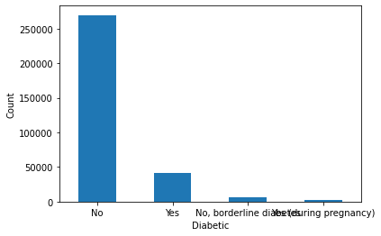
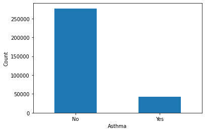
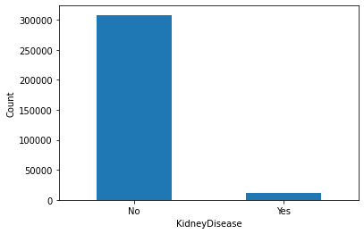
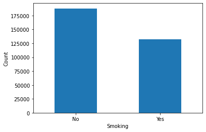
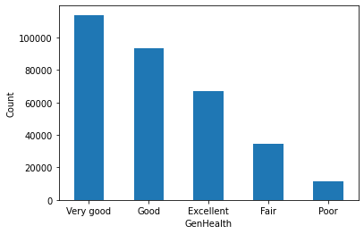
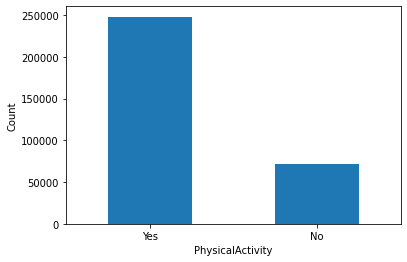

# ECS 171 Final Project

**Group 21**

- Nandhini Sridhar
- Trevor Lopez
- Dylan Ang
- Matthew Helkey


## About the Dataset


The [data set](https://www.kaggle.com/datasets/kamilpytlak/personal-key-indicators-of-heart-disease) comes from the CDC’s Behavioral Risk Factor Surveillance System, in which roughly 400,000 phone interviews are conducted every year. The original dataset has approximately 300 features, but this one has been previously reduced to 17. The dataset includes factors like BMI and age, lifestyle factors like smoking and alcohol use, and previous medical conditions like asthma and cancer.
 
> https://www.kaggle.com/datasets/kamilpytlak/personal-key-indicators-of-heart-disease

## Abstract

According to the CDC, heart disease is the leading cause of death in the US. To help classify causes for heart disease, the CDC conducts over 400,00 phone interviews annually, and compiles the results into a public dataset. We aim to use a subset of this data to determine important factors associated with heart disease. This analysis can be used to both inform the general public for practical lifestyle decisions and develop a predictive model for medical practices in considering the risk factors of patients. Using supervised learning algorithms, we plan to train a neural network to classify whether individuals have heart disease based on 17 features related to lifestyle and health conditions.

## Methods

We used the scikit-learn Python library in a [jupyter notebook](main.ipynb). 

### Data Exploration
We first found that none of the observations had missing data or null values, so we did not have to do anything with those. We did this using

```
df.isna().sum()
```

#### Categorical Data
We then figured out which variables in our data were categorical, and what unique values each variable had using:

```
categoricals = df.select_dtypes(include=['object']).columns.tolist()
for cat in categoricals:
    print(f'{cat}: {sorted(df[cat].unique())}')
```

We then plotted the frequency of the unique values of each categorical variable in bar charts. We found that a majority of survey participants did not have preexisting conditions such as skin cancer, heart disease, a previous stroke, difficulty walking, diabetes, asthma, or kidney disease. There were more non-smokers than smokers. The participants were almnost equally split between female and male, with more females. Additionally, there were more older participants from the ages 65-69, and older age groups tended to have more survey partcipants than younger age groups. More participants tended to rate their health as better rather than worse, with the most rating their general health as very good and the least rating their health as poor, and that most said they were physically active. We saw a huge disparity in our race distribution, with a clear majority of the survey participants being white. The bar charts are shown below, created with the following code:

```
display(df['SkinCancer'].value_counts().plot(kind='bar', xlabel='SkinCancer', ylabel='Count', rot=0))
display(df['HeartDisease'].value_counts().plot(kind='bar', xlabel='HeartDisease', ylabel='Count', rot=0))
display(df['Stroke'].value_counts().plot(kind='bar', xlabel='Stroke', ylabel='Count', rot=0))
display(df['DiffWalking'].value_counts().plot(kind='bar', xlabel='DiffWalking', ylabel='Count', rot=0))
display(df['Diabetic'].value_counts().plot(kind='bar', xlabel='Diabetic', ylabel='Count', rot=0))
display(df['Asthma'].value_counts().plot(kind='bar', xlabel='Asthma', ylabel='Count', rot=0))
display(df['KidneyDisease'].value_counts().plot(kind='bar', xlabel='KidneyDisease', ylabel='Count', rot=0))
display(df['Smoking'].value_counts().plot(kind='bar', xlabel='Smoking', ylabel='Count', rot=0))
display(df['Sex'].value_counts().plot(kind='bar', xlabel='Sex', ylabel='Count', rot=0))
display(df['AgeCategory'].value_counts().plot(kind='bar', xlabel='AgeCategory', ylabel='Count', rot=0))
display(df['GenHealth'].value_counts().plot(kind='bar', xlabel='GenHealth', ylabel='Count', rot=0))
display(df['PhysicalActivity'].value_counts().plot(kind='bar', xlabel='PhysicalActivity', ylabel='Count', rot=0))
display(df['Race'].value_counts().plot(kind='bar', xlabel='Race', ylabel='Count', rot=0))
```







<!--  -->





We recognized this as a potential source of bias if race ends up being an important factor in our prediction, as our model would likely be more effective at predicting heart disease in white people than other racial groups due to sample size.

#### Numerical Data
We created a heatmap and a pairplot to explore our numeric data. We chose not to include our categorical data even after enocding since most were binary valued and not ordered scales.


Our pairplot showed us the relationships between the various numeric variables as well as the distributions of each. We created the pariplot with:

```
sns.pairplot(df, hue='HeartDisease', plot_kws=dict(alpha=0.4))
```
which yielded a plot of:


BMI seemed to have a sort of skewed normal distribution, but all the others seemed to have distributions that were distinctly separated by the various data values. The scatter plots did not show much of a linear relationship between any of the variables. This is in accordance with the low correlations shown in the correlation matrix.

We confirmed that SleepTime, MentalHealth, and PhysicalHealth had discrete integer values with the following commands:

```
df['SleepTime'].unique() # see the discrete integer values 
df['MentalHealth'].unique()
df['PhysicalHealth'].unique()
```


### Preprocessing
After performing exploratory data anlysis, we label encoded our categorical variables. We opted for one-hot encoding for encoding the race of the person, as race is not a scale, nor is it binary. We did this with the following code:

* Label Encoding
```
encode = lambda unique: dict( zip( sorted(unique), range(len(unique)) ) )

# encode( df[categoricals[0]].unique() )
encoding = {'GenHealth': {'Poor': 0, 'Fair': 1, 'Good': 2, 'Very good': 3, 'Excellent': 4}}

# perform genhealth encoding manually since no sorting function
df_encode = df.copy()
for c in categoricals:
  if c != 'GenHealth': encoding[c] = encode(df[c].unique()) # save to encoding
  df_encode[c] = df.apply( lambda row: encoding[c][row[c]], axis=1) # perform encoding

encoding
```
* One-Hot Encoding
```
df_encode['American Indian/Alaskan Native'] = df_encode.apply( lambda x: int(x.Race == 0), axis=1)
df_encode['Asian'] = df_encode.apply( lambda x: int(x.Race == 1), axis=1)
df_encode['Black'] = df_encode.apply( lambda x: int(x.Race == 2), axis=1)
df_encode['Hispanic'] = df_encode.apply( lambda x: int(x.Race == 3), axis=1)
df_encode['White'] = df_encode.apply( lambda x: int(x.Race == 5), axis=1)
df_encode['Other Race'] = df_encode.apply( lambda x: int(x.Race == 4), axis=1)
df_encode = df_encode.drop(columns=['Race'])
```


We then explored the distributions of race in our data set and discovered that over 75% of the data is listed as white using the following:

```
races = df_encode[['Asian', 'Black', 'Hispanic', 'American Indian/Alaskan Native', 'White', 'Other Race']].sum()
print(races / races.sum() * 100)
```

This could lead to our final model being better at predicting heart disease in white people than in other races. Finally, we normalized the numerical variables in our data to be between 0 and 1 using the following:

```
df_num = df.select_dtypes(include=['float64'])

from sklearn.preprocessing import MinMaxScaler

scaler = MinMaxScaler()
df_num_norm = scaler.fit(df_num).transform(df_num)
df_num_norm = pd.DataFrame(df_num_norm, columns=df_num.columns, index=df_num.index)
df_num_norm.head()

# adding scaled data back into full data set
numericals = df.select_dtypes(include=['float64']).columns
dft = df_encode.copy()
for colname in numericals:
    dft[colname] = df_num_norm[colname]
```

### Model 1
Our initial model was built with three layers: an input layer with a tanh activation function and 4 units, a hidden layer with a relu activation function and 4 units, and an output layer with a sigmoid activation function, since our aim is to do binary classification. Predictions were then thresholded with a threshold of 0.5. 

We split our data into training and testing sets:
```
from sklearn.model_selection import train_test_split

X = dft.drop(columns=['HeartDisease'])
y = dft['HeartDisease']

X_train, X_test, y_train, y_test = train_test_split(X, y, test_size=0.2, random_state=42)
dims = X_train.shape[1]
```

We then created and fit the model with:
```
from keras.models import Sequential
from keras.layers import Dense

model = Sequential()
model.add(Dense(units=4, activation='tanh', input_dim=dims,  ))
model.add(Dense(units=4, activation='relu', input_dim=dims,))
model.add(Dense(units=1, activation='sigmoid', input_dim=dims,  ))

model.compile(optimizer = 'rmsprop', loss = 'binary_crossentropy')
history = model.fit(X_train.astype('float'), y_train, batch_size = 1, epochs = 10)
```

### Model 2
We also created a Logistic Regression model with:
```
from sklearn.linear_model import LogisticRegression

# training
model2 = LogisticRegression(max_iter=1000, random_state=42)
model2.fit(X_train, y_train)
yhat_train = model2.predict(X_train)
yhat_test = model2.predict(X_test)
```

We used a classification report to find the performance metrics with this model, and created a similar model using overfitting to increase recall for people with heart disease.

### Model 3
We created a Logistic Regression model with overfitting:
```
from imblearn.over_sampling import RandomOverSampler
ros = RandomOverSampler(random_state=42)
X_train_res, y_train_res = ros.fit_resample(X_train, y_train)
# training
model3 = LogisticRegression(max_iter=1000, random_state=42)
model3.fit(X_train_res, y_train_res)
yhat_train = model3.predict(X_train)
yhat_test = model3.predict(X_test)
```

This helped increase recall for people with heart disease but lowered accuracy.

## Results

### Model 1
After predictions were thresholded with a threshold of .5, the initial model had a training data accuracy of about 92% and a testing data accuracy of about 91%. The model was not at the absolute minima of the fitting graph, but instead one step up with a higher loss than the minima. 

### Model 2


## Discussion

Our model reports an accuracy of 0.91, which means that we correctly categorized 91% of our testing data as having heart disease or not. 
We had a precision of 0.92 for 0, which means that of the patients we identified as not having heart disease, 92% of them did not have heart disease, the other 8% are false negatives.
We had a recall of 0.99 for 0, which means that of all the observations who did not have heart disease, we correctly identified 99% of them. 

What these numbers tell us is that if you do not have heart disease, our model has a 99% chance of identifying you as such, but if our model identifies you as not having heart disease, there is only a 92% chance that you actually do not have heart disease.
Future iterations should focus on higher recall, to minimize false negatives.
In addition, our precision and recall are much lower for 1, or the chance of having heart disease. Future models can try to increase these by oversampling.

Due to this difference in precision and recall, we think it would be better to use this model as an initial diagnosis, followed by confirmation by a physician. 
Currently, the best tests for heart disease are invasive tests involving blood work profiling cholesterol or protein levels.
EKG's are minimally invasive but require a visit to the doctor or expensive home equipment, and one study by Taber, Levya, Persoskie found that over 30% of Americans they surveyed avoided seeing the doctor for various reasons involving high cost, lack of health insurance, etc. 

Our model can provide a method for an initial screening, where patients who test positive can be referred for additional tests.
Our model is non-invasive and can be done at home, and this may allow less privileged communities to get a better understanding of their health. 

## Conclusion
We see from the results that the first neural network model was made redundant by our logistic regression models which ran much faster. We also saw that there was a major problem of the target not being balanced which we only really considered with our last model via random oversampling. One thing to consider is if other sampling strategies like [SMOTE](https://machinelearningmastery.com/smote-oversampling-for-imbalanced-classification/) could yield better results instead of just duplicating randomly from the minority class.

We could also approach the task with a different type of model. We were able to see some indication of the important factors of our oversampled logistic regression via the coefficients, but we could get another indication via methods of a Decision Tree learning. However, we would need to be cognizant of the sensitivity of this approach to overfitting and imbalanced data. We could then use a Random Forest model with [some sampling like stratified bootstrap](https://timvink.nl/post-balanced-trees/) to maybe get more stable results. With this sort of model, we could then interpret the hierarchical structure of the final resulting tree.

Lastly, we could go back to an approach with a neural network. There was various tuning that could have been done for such a task like changing the structure of the neural network via the number of layers and activation functions, and there are also training parameters like optimizers, batch size, and number of epochs that might better minimize loss or be more stable in convergence.

## Sources 

Taber, Jennifer M et al. “Why do people avoid medical care? A qualitative study using national data.” Journal of general internal medicine vol. 30,3 (2015): 290-7. doi:10.1007/s11606-014-3089-1

## Collaboration

Dylan Ang: Contributed to initial data exploration and preprocessing, scaling and the Discussion section.

Nandhini Sridhar: Contributed to initial model building, Methods section, and introduction about the dataset and abstract.

Trevor Lopez: Contributed ideas for the initial data exploration and for the preprocessing encodings. Also wrote everything for the logistic regession model sections of the jupyter notebook. In the writeup, I worked on the Conclusion section.

